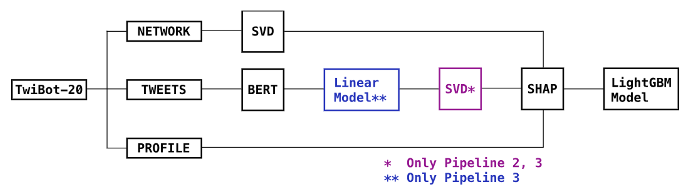

# Twitter Bot Detection
 Project developed for bot detection on Twitter (X) in the Synthetic Realities course in my master's program at UNICAMP.

 ## Objective

The primary goal of this study is to offer a robust solution for detecting bots using the TwiBot-20 dataset. This approach combines semantic analysis, profile characteristic examination, and neighborhood information exploration to effectively address the challenge of bot identification on the X platform. The methodology workflow is illustrated in the figure below:

## Dataset

The analysis relies on the TwiBot-20 dataset, a publicly available Twitter bot detection benchmark. Spanning user-generated content on platform X from July to September 2020, the dataset comprises:

- 229,573 users
- 33,488,192 tweets
- 8,723,736 user property items
- 455,958 follow relationships

The dataset is pre-divided into training and testing sets, with the balanced proportion for bot/human labeling as 0.561247/0.438753 and 0.540997/0.4590003 for each set, respectively. For validation purposes, a 20% subsample was extracted from the training set to facilitate feature selection.

The dataset is publicly available and can be accessed via the reference below:

- [1] Shangbin Feng, Herun Wan, Ningnan Wang, Jundong Li, and Minnan Luo. Twibot-20: A comprehensive Twitter bot detection benchmark. Proceedings of the 30th ACM International Conference on Information & Knowledge Management, 2021.

## Labeling Process

The labeling process of this dataset was performed via crowdsourcing, employing criteria such as:

- Identifying tweets lacking originality
- Recognizing highly automated activities
- Presence of verified account marks
- Detecting tweets with phishing or commercial links
- Pinpointing repeated content
- Flagging tweets with irrelevant URLs

Understanding the nuances of this annotation procedure contributes to the interpretability and insightfulness of the model training.

## Feature Extraction

From the data, three types of features were extracted:

### 1. User-based features
A range of demographics extracted from each profile, including variables such as the number of followers, the presence of a profile image, verification status, location, and more. A comprehensive overview of the utilized variables is available in Table 1.

### 2. Network features
Incorporating Singular Value Decomposition (SVD) with a dimensionality of 30, this technique was applied to the adjacency matrix of the graph, which includes follows and followers relationships. The resulting features from this process were then employed as graph embeddings.

### 3. Content features
Utilizing BERT (Bidirectional Encoder Representations from Transformers), embeddings were crafted from a user’s most recent 200 tweets, calculating their mean value.