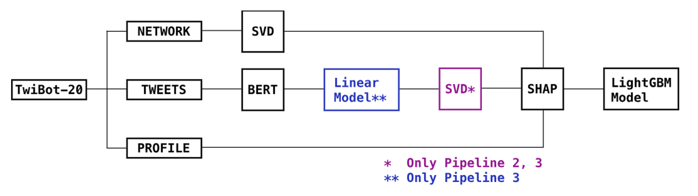

# 🕵️‍♂️ Twitter Bot Detection

Project developed for bot detection on Twitter (X) in the Synthetic Realities
course in my master's program at UNICAMP.

## 🎯 Objective

This study offers a bot-detection workflow using the TwiBot-20 dataset. It
combines semantic analysis, profile characteristics, and neighbourhood
information to identify bots on X.



## 📊 Dataset and data availability

The analysis uses the publicly available
[TwiBot-20](https://twibot20.github.io/) Twitter bot-detection benchmark,
which covers user-generated X content from July to September 2020:

- 👥 229,573 users
- 🐦 33,488,192 tweets
- 🏷️ 8,723,736 user property items
- 🔗 455,958 follow relationships

The dataset provides predefined training and testing sets. A 20% subsample of
the training set can be used as validation data during feature selection.
Download the dataset from its public source before running the end-to-end
notebook, then place its files under `datasets/Raw/`. The repository includes
only placeholders and selected processed feature metadata; it does not
redistribute the raw TwiBot-20 data.

> Shangbin Feng, Herun Wan, Ningnan Wang, Jundong Li, and Minnan Luo.
> *TwiBot-20: A comprehensive Twitter bot detection benchmark.* Proceedings
> of the 30th ACM International Conference on Information & Knowledge
> Management, 2021.

## 🏷️ Labeling process

TwiBot-20 labels were crowdsourced using signals including unoriginal tweets,
automated activity, verified-account marks, phishing or commercial links,
repeated content, and irrelevant URLs.

## 📈 Feature extraction

The workflow uses three feature families:

1. **User-based features** — profile demographics such as follower count,
   profile image, verification status, and location.
2. **Network features** — SVD embeddings derived from follow and follower
   relationships.
3. **Content features** — BERT embeddings from each user's most recent 200
   tweets, optionally reduced with supervised or unsupervised SVD.

## Project structure

- `src/twitter_bot_detection/`
  - `etl.py`
  - `eda.py`
  - `feature_selection.py`
- `notebooks/e2e_example.ipynb` — step-by-step end-to-end example
- `datasets/` — downloaded raw data, placeholders, and processed metadata
- `pyproject.toml`
- `requirements.txt`

## Install

```bash
pip install -e .
pip install -r requirements.txt
```

## Usage

```python
from twitter_bot_detection.etl import make_profile_df, make_tweets_df
from twitter_bot_detection.eda import profile_data_preprocessing
from twitter_bot_detection.feature_selection import backwards_shap_feature_selection
```

Use `notebooks/e2e_example.ipynb` to run the workflow from loading the
downloaded dataset through preprocessing, baseline model training, and
evaluation.
